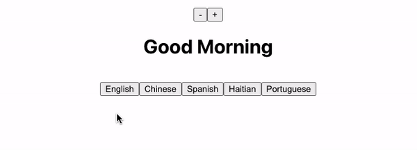

# Multilingual Lab

You will be building out the following project. You should divide your UI into the appropriate components and should utilize state and the `useState` hook. 

## Demo of App

## Features

* Your app should render as a greeting (perhaps, "Good Morning") in English. 
* Beneath this greeting, there should be five buttons. 
* Each button should correspond to a different language (perhaps, "Spanish", "Haitian Creole", and "Portuguese"). 
* When a language button is clicked, the greeting above should be translated to the appropriate language.
* Above your greeting, there should be two buttons to change the font size.
* When the buttons are clicked, the greeting size should grow or shrink accordingly. 
* Your greeting should be its own component. In addition, each set of buttons should be their own component. 

## Set Up
It's highly recommended you use the scaffolding tool [Create React App](https://reactjs.org/docs/create-a-new-react-app.html) to create your starter code. 
1. Run the command `npx create-react-app <name-of-your-app>`. 
2. `cd` into your newly created project.
3. Run `npm start`.

